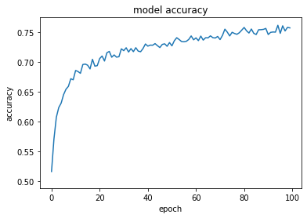
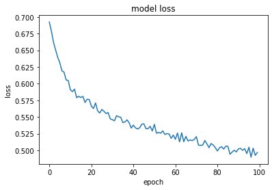
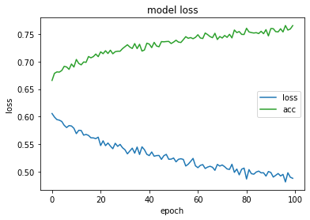

# Binary Image Classifiaction
Classifying dogs and cats using Convolutional Neural Network(CNN)

The model implementation is done using Keras library with Python3.

# Model Accuracy v/s epochs

# Model Loss v/s epochs

Loss v/s Accuracy

You can get the dataset from [Kaggle](https://www.kaggle.com/kashaudhan94/dataset)
